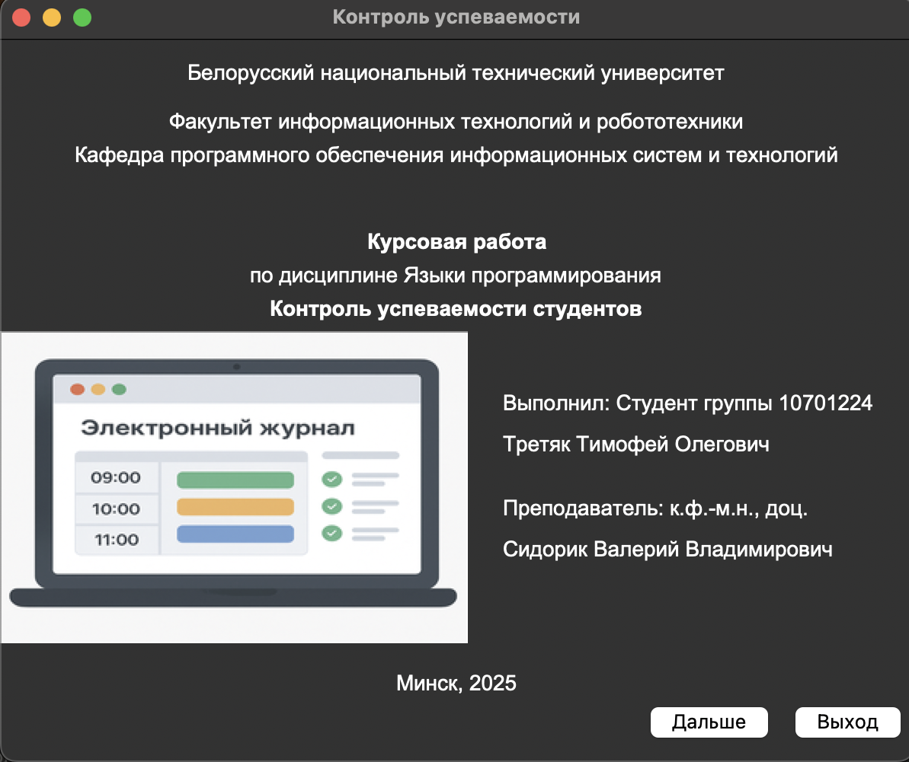
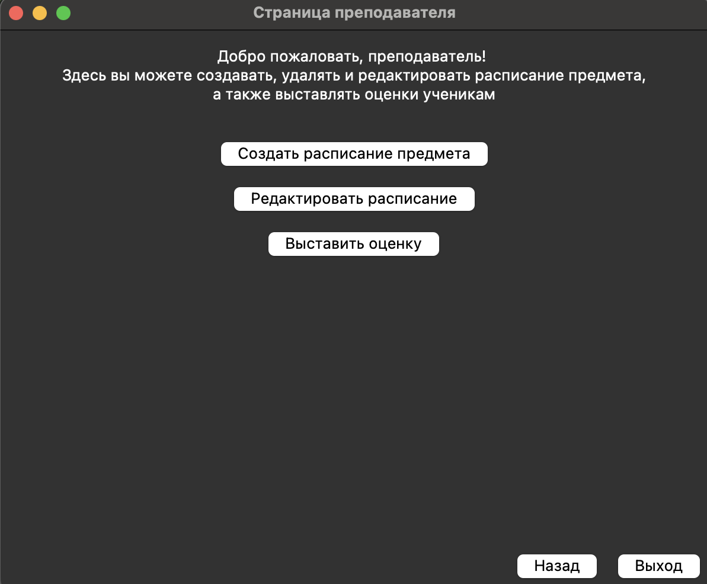
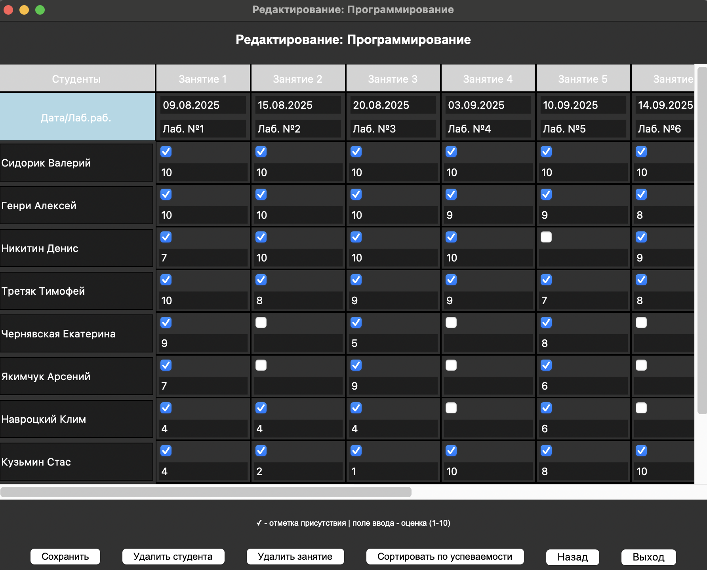

# Academic Control System / Electronic Journal

**Python 3.8+ | Tkinter | SQLite | PyInstaller**

## Overview

Academic Control System is a desktop application for managing student academic performance. Built for Belarusian National Technical University (BNTU) as a course project. The system provides role-based access (teacher/student), scheduling, grading, attendance tracking, and real-time statistics — all stored locally in SQLite.

## Features

- **Role-Based Access** — Teacher (full control) / Student (read-only)
- **Schedule Management** — Create/edit/delete subjects with custom lesson plans
- **Student Registry** — Global student database with unique IDs
- **Attendance Tracking** — Checkbox-based attendance per lesson
- **Grading System** — Grades 1–10 for assignments + exams
- **Automatic Calculations** — Average score, attendance percentage
- **Dual Sorting** — Alphabetical / by academic performance (descending average)
- **Data Validation** — Real-time grade validation (1–10), unique subject names
- **SQLite Persistence** — All data stored locally with foreign key integrity
- **macOS Native App** — Standalone `.app` bundle (PyInstaller)

## Tech Stack

| Technology | Purpose |
|------------|---------|
| Python 3.8+ | Core language |
| Tkinter | Native GUI framework |
| SQLite | Embedded relational database |
| Pillow | Image processing (photos) |
| PyInstaller | macOS `.app` compilation |

## Quick Start

### Prerequisites

- macOS 10.15+ / Windows / Linux
- Python 3.8+ (for source run)
- No external database setup required

### Local Development

```bash
# Clone repository
git clone https://github.com/Timafei-Tratsiak/Python-electronic-journal.git
cd Python-electronic-journal

# Install dependencies
pip install Pillow

# Run application
python main.py
```
### Run Compiled App (macOS)

```bash
# Open .app bundle
open dist/AcademicControl.app
```
```Default teacher password: 1234```

### Screenshots

| Main Window | Teacher Dashboard | Grade Table |
|-------------|-------------------|--------------|
|  |  |  |

### Database Schema

```sql
global_students (id, student_name)
subjects (id, name, has_exam)
schedules (id, subject_id, lesson_number, date, lab_work)
students (id, global_student_id, schedule_id, student_row, display_name)
attendance (id, student_id, lesson_number, attendance, grade)
exams (id, subject_id, student_id, exam_grade)
```

### Key Algorithms

#### Average Score Calculation

```text
avg = (sum of assignment grades + exam grade) / (number of assignments + exam if exists)
Returns -1 if no grades available.
```

### Sorting by Performance

- Calculates average for each student
- Sorts descending by average
- Preserves `student_row` order in database

### Grade Validation

| Input | Result |
|-------|--------|
| `1` – `10` | ✅ Accepted |
| `""` (empty) | ✅ Allowed (no grade yet) |
| `11`, `-5`, `abc` | ❌ Rejected with error |

### Project Structure

```text
academic_control/
├── main.py                 # Entry point
├── database.py             # SQLite wrapper
├── config.py               # Window sizes, password, limits
├── academic_control.db     # Auto-generated database
├── assets/                 # Program & author photos
├── windows/                # GUI modules
│   ├── main_window.py
│   ├── role_window.py
│   ├── teacher_auth.py
│   ├── teacher_main.py
│   ├── student_window.py
│   ├── schedule_windows.py
│   └── about_windows.py
└── utils/                  # Helpers
    ├── validators.py       # Grade & input validation
    └── sorters.py          # Alphabetical/performance sort
```

### Test Results

| Test Case | Expected | Actual |
|-----------|----------|--------|
| Teacher login with `1234` | Access granted | ✅ Pass |
| Create course (30 students, 20 lessons) | Saved to DB | ✅ Pass |
| Enter grade `11` | Error message | ✅ Pass |
| Sort by performance | Descending by average | ✅ Pass |
| Student login with ID + name | Read-only access | ✅ Pass |

### Performance

| Metric | Value |
|--------|-------|
| Window open time | < 2 sec |
| Database load (30 students × 20 lessons) | < 3 sec |
| Sort operation | < 5 sec |
| Memory usage | < 200 MB |

### Author

#### Timofey Tratsiak (Timafei-Tratsiak)
Student, group 10701224
Faculty of Information Technologies and Robotics, BNTU
📧 timatretiak@gmail.com

Supervisor: PhD, Associate Professor Valery Sidorik
